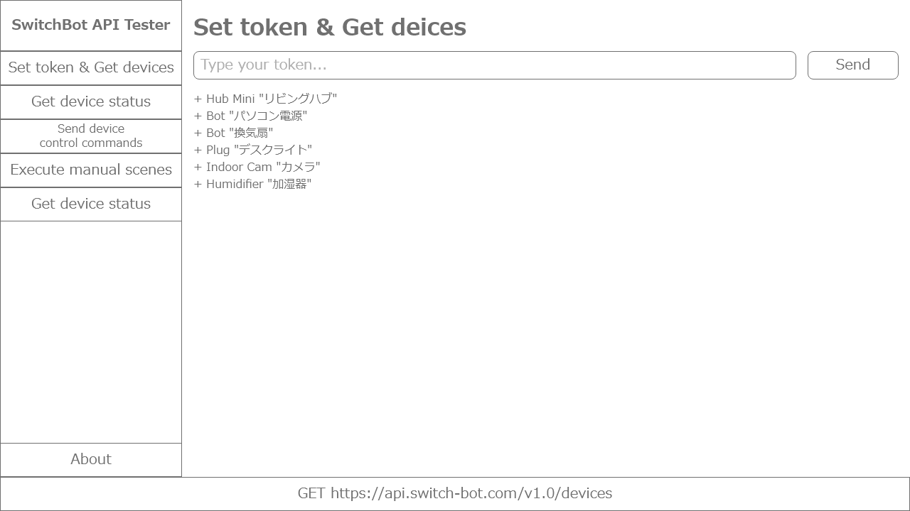

# SwitchBotAPITester

SwitchBot APIをお手軽に試したいとき用のソフト

## README

- Japanese (here)

## コマンド

	npm start : アプリケーションを開始
	npm run build-win : Windows版をビルド
	npm run build-mac : Mac版をビルド

## 開発目標

- 開発者トークンを入力すればREST APIを通じてデバイスを制御することができる
- (テスターなので) 各種通信情報は見られるようにする
	- リクエストURL、リクエストボディ
	- レスポンスURL
	- リクエストヘッダはトークンをつけるだけなのでテキスト説明で済ませる
	- リクエストの成否はインスペクターバーのURL右のアイコンで判別。なので少なくとも読込中/成功/失敗の3アイコン必要
- 多言語対応を目論んでおく (自分で翻訳はしない。というかできない)
	- `Japanese.lang`(中身はJSON)を用意してそれを参照。言語切替メニューの項目はそのままファイル名
	- 分かる部分に関しては`English.lang`も用意しておく？

