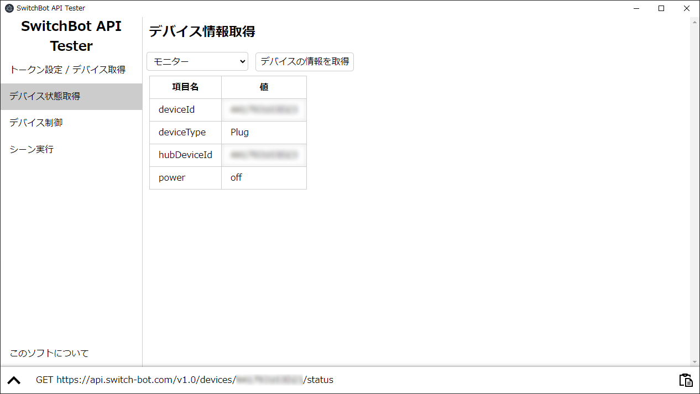

# SwitchBotAPITester

SwitchBot APIをお手軽に試したいとき用のソフト

## README

- Japanese (here)

## このソフトについて

SwitchBot APIをお手軽に試したいときに使うソフトです。  
インストール後、開発者トークンを入力するとAPIからできることを試すことができます。  
ちょっと試したいだけなのにわざわざ英語のドキュメントを読んだりPostmanを使うのは面倒、というときにおすすめです。

## コマンド

	npm start : アプリケーションを開始
	npm run build-win : Windows版をビルド
	npm run build-mac : Mac版をビルド

## 開発状況/目標

- [ ] 各種情報の保存
	- [x] トークンの保存
	- [ ] デバイスリストの保存
	- [ ] シーンリストの保存
	- [ ] データ削除 (アンインストールで消えるので実装しないかも)
- [ ] APIとの通信と結果表示
	- [x] デバイス一覧の取得
	- [x] デバイス情報の取得
	- [ ] デバイスへの制御コマンド送信
	- [x] シーン一覧の取得
	- [x] シーンの実行
- [ ] 通信内容の表示
	- [x] URLとメソッドの表示
	- [ ] 成功可否や通信中アイコン
	- [x] リクエストボディ/レスポンスボディの表示
	- [ ] JSONシンタックスハイライト
- [ ] 言語ファイル
	- [ ] 言語自動設定
	- [ ] 言語手動設定

